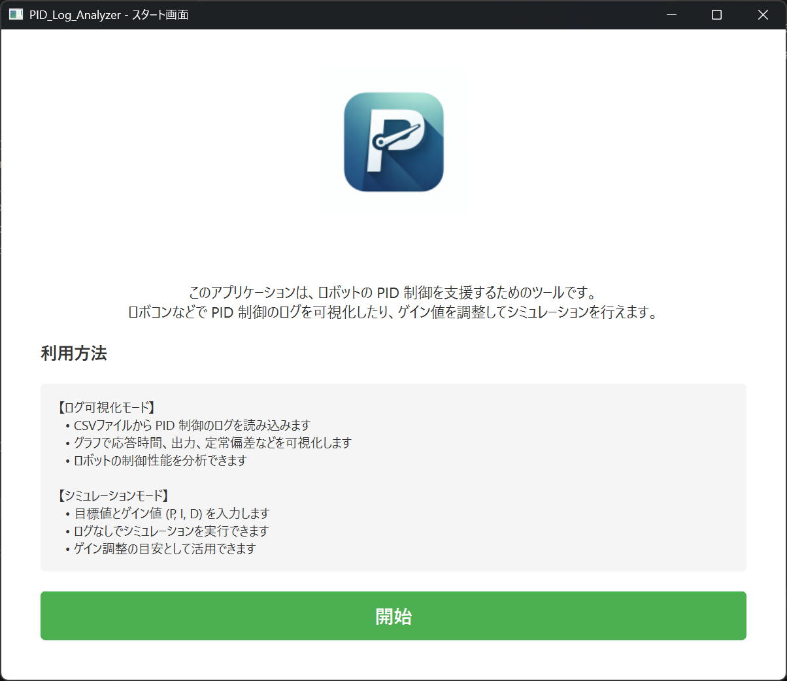
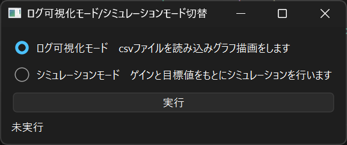
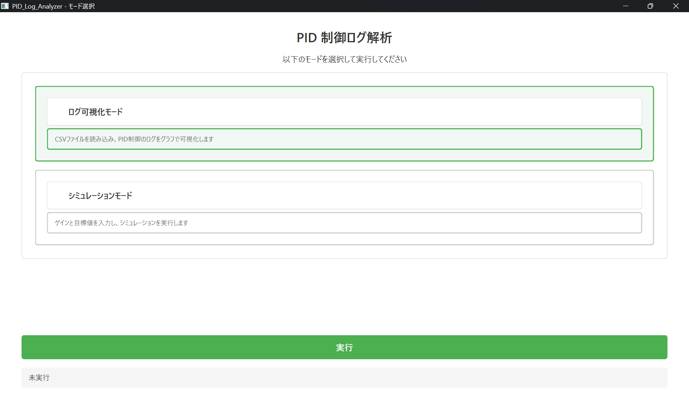

# PID_Log_Analyzer

## ⚙ システム概要
PID_Log_Analyzerは主にロボコンに出場するロボコニストを対象にした**制御補助アプリケーション**です。
PID制御の際にでるログを可視化したり、PID制御のシミュレーションを行うことが可能です。
PID制御を行う際に定常偏差が打ち消されないことによるハンチング(それによっておこる暴走)が起きていないか、応答速度は正常か、目標値に到達しているかなどの項目について判断する際にログを見ることは大変重要になってきます。
しかし、膨大な量の数字の羅列を見ることは効率がとても悪く、限られた時間の中で最適なパフォーマンスを出さなければならないロボコニストとして大変煩わしい時間です。
そのため、このシステムでは**経過時間、出力を軸としたグラフ**を描画することで**直感的なPID制御**をサポートします。
また、「ログが取れないけどゲイン調整の目安にしたい」という人のために、ゲインと目標値を入力さえすれば応答などをシュミレーションできます。

また、このプロジェクト自体がsample.csvを保持しているため、具体的なcsvファイルの中身、簡易的な動作テストが可能です。
## 📅製作期間
2025/12 ~ 2026/01
## このシステムで可能なこと
1.PID制御のログをcsv形式で読み込むことでそれらの応答時間、出力、定常偏差などの可視化。
2.目標値、ゲインを指定することで最適なゲイン調整の補助。
## 📷システム外観のスクリーンショット



モード選択前のUIです




モード選択のシンプルなUIです


シミュレーションモードでの値入力画面です


目標値、現在の出力、差が表示されています。




CSVをロードしてログを表示するモードの画面です


## 🔧環境構築

### 前提条件
- VS Code がインストール済み
- Python がインストール済み

### セットアップ手順

#### 1. リポジトリをクローン
```bash
git clone <repository-url>
cd PID_Log_Analyzer
```

#### 2. pyenv で Python バージョン指定（推奨）
```bash
# pyenv をインストール（未インストールの場合）
# Windows: https://github.com/pyenv-win/pyenv-win

# Python 3.13 を指定
pyenv local 3.13.0

# またはプロジェクト内に .python-version ファイルを作成
echo "3.13.0" > .python-version
```

#### 3. 仮想環境を作成・有効化
```bash
# 仮想環境を作成
python -m venv .venv

# 仮想環境を有効化（Windows PowerShell）
.venv\Scripts\Activate.ps1

# または CMD の場合
.venv\Scripts\activate.bat

# Linux/Mac の場合
source .venv/bin/activate
```

#### 4. 依存パッケージをインストール
```bash
pip install --upgrade pip
pip install -r requirements.txt
```

#### 5. VS Code の Python インタープリタを設定
1. VS Code を開く
2. `Ctrl + Shift + P` で コマンドパレット を開く
3. `Python: Select Interpreter` を検索
4. `./.venv/Scripts/python` (Windows) または `./.venv/bin/python` (Linux/Mac) を選択

#### 6. アプリケーションを実行
```bash
# 仮想環境が有効な状態で実行
python main.py
```

### 必要なパッケージ
- `numpy` - 数値計算
- `matplotlib` - グラフ描画
- `pandas` - データ処理
- `PySide6` - GUI フレームワーク

### トラブルシューティング
| 問題 | 解決方法 |
|------|--------|
| PySide6 が見つからない | `pip install PySide6` を実行 |
| Python バージョンが合わない | `pyenv local 3.13.0` で指定 |
| 仮想環境が有効化されていない | `.venv\Scripts\Activate.ps1` を実行 |
| matplotlib が動作しない | `pip install --upgrade matplotlib` を実行 |


# ライセンス

このプロジェクトは LGPL v3 の下でライセンスされています。

## 依存パッケージ
- **PySide6**: LGPL v3 (Qt Company, The Qt Company Ltd.)
- **numpy**: BSD License
- **matplotlib**: PSF License
- **pandas**: BSD License

詳細は `docs/LICENSE` をご覧ください。